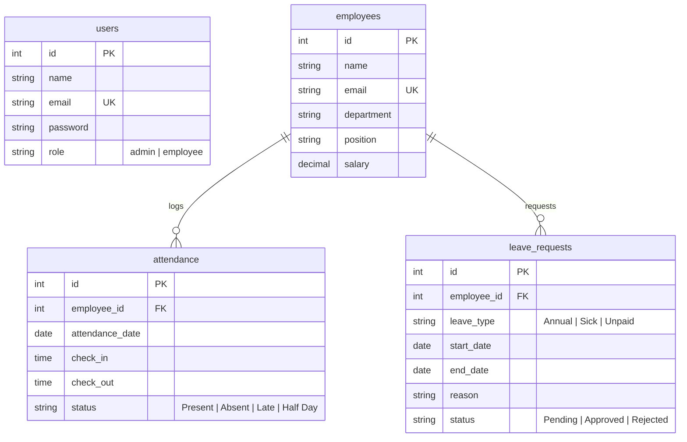

# SmartERP-CRM: Backend Architecture & API Specification

This document provides a comprehensive technical blueprint of the backend architecture of the **SmartERP-CRM** application. It details the Node.js/Express framework, TypeScript configurations, PostgreSQL database schema, security layer, middleware implementations, and API endpoint specifications.

---

## Table of Contents
1. [System Overview](#1-system-overview)
2. [Database Architecture & SQL Schema](#2-database-architecture--sql-schema)
3. [Security, Encryption & Middleware](#3-security-encryption--middleware)
4. [Controller & Model Modules](#4-controller--model-modules)
5. [REST API Specifications](#5-rest-api-specifications)
6. [Backend Directory Structure](#6-backend-directory-structure)
7. [Installation & Deployment Guide](#7-installation--deployment-guide)

---

## 1. System Overview

The **SmartERP-CRM** backend is designed as a secure, stateless, and high-performance **RESTful API** built on a modern development stack:

| Component | Technology | Purpose |
| :--- | :--- | :--- |
| **Runtime Environment** | Node.js (v18+) | Lightweight, asynchronous, event-driven JavaScript engine. |
| **Web Server Framework** | Express (v5.2+) | Fast, unopinionated web framework for routing HTTP requests. |
| **Language Wrapper** | TypeScript (v5.9+) | Static typing, interface definitions, and compile-time code safety. |
| **Relational Database** | PostgreSQL (v14+) | ACID-compliant relational SQL storage with strong consistency. |
| **Database Pool Driver** | `pg` (node-postgres) | Connection pooler executing raw parameter-safe SQL queries. |
| **Hashing Engine** | `bcrypt` (v6.0+) | Secure, salted cryptographic password hashing. |
| **Security Standard** | JWT (`jsonwebtoken`) | Stateless token authorization for secure client session exchanges. |

---

## 2. Database Architecture & SQL Schema

The database relies on raw relational tables with strong integrity, enforced via primary keys, unique constraints, and foreign keys:



### 2.1. SQL Schema Script
The database and tables are constructed using the following SQL queries:

```sql
-- 1. Create Users Table (Authentication & Security Profiles)
CREATE TABLE users (
    id SERIAL PRIMARY KEY,
    name VARCHAR(100) NOT NULL,
    email VARCHAR(150) UNIQUE NOT NULL,
    password VARCHAR(255) NOT NULL,
    role VARCHAR(50) DEFAULT 'employee' CHECK (role IN ('admin', 'employee'))
);

-- 2. Create Employees Table (HR Records)
CREATE TABLE employees (
    id SERIAL PRIMARY KEY,
    name VARCHAR(100) NOT NULL,
    email VARCHAR(150) UNIQUE NOT NULL,
    department VARCHAR(100) NOT NULL,
    position VARCHAR(100) NOT NULL,
    salary DECIMAL(12, 2) NOT NULL
);

-- 3. Create Attendance Table (Daily logs)
CREATE TABLE attendance (
    id SERIAL PRIMARY KEY,
    employee_id INT NOT NULL REFERENCES employees(id) ON DELETE CASCADE,
    attendance_date DATE NOT NULL,
    check_in TIME NOT NULL,
    check_out TIME,
    status VARCHAR(50) DEFAULT 'Present' CHECK (status IN ('Present', 'Absent', 'Late', 'Half Day')),
    UNIQUE (employee_id, attendance_date)
);

-- 4. Create Leave Requests Table (Time-Off Tracking)
CREATE TABLE leave_requests (
    id SERIAL PRIMARY KEY,
    employee_id INT NOT NULL REFERENCES employees(id) ON DELETE CASCADE,
    leave_type VARCHAR(100) NOT NULL CHECK (leave_type IN ('Annual', 'Sick', 'Maternity/Paternity', 'Unpaid')),
    start_date DATE NOT NULL,
    end_date DATE NOT NULL,
    reason TEXT NOT NULL,
    status VARCHAR(50) DEFAULT 'Pending' CHECK (status IN ('Pending', 'Approved', 'Rejected')),
    CHECK (start_date <= end_date)
);
```

---

## 3. Security, Encryption & Middleware

The backend applies standard REST security filters to parse and guard HTTP requests:

### 3.1. Hashing with Bcrypt
When registering new users via `POST /api/auth/register`, the password is cryptographically salted and hashed before storing it:
```typescript
const hashedPassword = await bcrypt.hash(password, 10);
```

### 3.2. Session Authentication Middleware (`authMiddleware.ts`)
Validates that incoming client requests possess a valid token. If present, it decodes the payload and mounts it to `req.user`.

```typescript
import { Request, Response, NextFunction } from "express";
import jwt from "jsonwebtoken";

export interface AuthenticatedRequest extends Request {
  user?: {
    id: number;
    email: string;
    role: string;
  };
}

export const authenticate = (req: AuthenticatedRequest, res: Response, next: NextFunction) => {
  const authHeader = req.headers.authorization;
  if (!authHeader || !authHeader.startsWith("Bearer ")) {
    return res.status(401).json({ message: "Access Denied: Missing Token" });
  }

  const token = authHeader.split(" ")[1];
  try {
    const verified = jwt.verify(token, process.env.JWT_SECRET as string);
    req.user = verified as AuthenticatedRequest["user"];
    next();
  } catch (error) {
    res.status(401).json({ message: "Invalid Token" });
  }
};
```

### 3.3. Role Authorization Middleware (`roleMiddleware.ts`)
Guards administrative actions, ensuring only users with `role: 'admin'` are allowed to write database changes:

```typescript
import { Response, NextFunction } from "express";
import { AuthenticatedRequest } from "./authMiddleware";

export const authorize = (allowedRole: string) => {
  return (req: AuthenticatedRequest, res: Response, next: NextFunction) => {
    if (!req.user || req.user.role !== allowedRole) {
      return res.status(403).json({ message: "Forbidden: Access level insufficient" });
    }
    next();
  };
};
```

---

## 4. Controller & Model Modules

The APIs are divided into five functional modules:

### 4.1. Authentication Module
* **Logic (`authController.ts`)**: Validates emails, performs hashed password checks, signs a JSON Web Token (JWT) containing database identifiers, and returns user data to the client.
* **Storage (`userModel.ts`)**: Direct raw SQL insertions and query lookups against the `users` table.

### 4.2. Employee Roster Module
* **Logic (`employeeController.ts`)**: Processes employee profile updates.
* **Storage (`employeeModel.ts`)**: Raw SQL updates (`INSERT`, `SELECT`, `UPDATE`, `DELETE`) mapping key metrics like name, email, department, position, and annual salary.

### 4.3. Attendance Tracking Module
* **Logic (`attendanceController.ts`)**: Records check-in/out timestamps and computes employee daily status labels.
* **Storage (`attendanceModel.ts`)**: Inserts and updates attendance records.

### 4.4. Leave Requests Module
* **Logic (`leaveController.ts`)**: Manages vacation request filings and administrative approval overrides.
* **Storage (`leaveModel.ts`)**: Maps records to the `leave_requests` table.

### 4.5. Dashboard Metrics Module
* **Logic (`dashboardController.ts`)**: Executes high-performance aggregate count queries to yield overall stats:
  ```typescript
  const totalEmployees = await pool.query("SELECT COUNT(*) FROM employees");
  const presentToday = await pool.query("SELECT COUNT(*) FROM attendance WHERE attendance_date = CURRENT_DATE AND status = 'Present'");
  const absentToday = await pool.query("SELECT COUNT(*) FROM attendance WHERE attendance_date = CURRENT_DATE AND status = 'Absent'");
  const totalLeaves = await pool.query("SELECT COUNT(*) FROM leave_requests");
  const pendingLeaves = await pool.query("SELECT COUNT(*) FROM leave_requests WHERE status = 'Pending'");
  const approvedLeaves = await pool.query("SELECT COUNT(*) FROM leave_requests WHERE status = 'Approved'");
  const rejectedLeaves = await pool.query("SELECT COUNT(*) FROM leave_requests WHERE status = 'Rejected'");
  ```

---

## 5. REST API Specifications

The following table documents the backend routes and endpoints:

| Endpoint Route | HTTP Verb | Authentication | Roles | Request Body (Payload) | Success Response (200/201) | Error Codes |
| :--- | :--- | :--- | :--- | :--- | :--- | :--- |
| **`/api/auth/register`** | `POST` | Public | Open | `{ name, email, password }` | `{ message, user }` | `400`, `500` |
| **`/api/auth/login`** | `POST` | Public | Open | `{ email, password }` | `{ message, token, user }` | `401`, `404`, `500` |
| **`/api/auth/profile`** | `GET` | Authenticated | Open | None | `{ message, user }` | `401`, `500` |
| **`/api/dashboard`** | `GET` | Authenticated | Open | None | `{ stats: { totalEmployees, presentToday... } }` | `401`, `500` |
| **`/api/employees`** | `GET` | Authenticated | Open | None | `{ employees: [...] }` | `401`, `500` |
| **`/api/employees`** | `POST` | Authenticated | `admin` | `{ name, email, department, position, salary }` | `{ message, employee }` | `401`, `403`, `500` |
| **`/api/employees/:id`**| `PUT` | Authenticated | `admin` | `{ name, email, department, position, salary }` | `{ message, employee }` | `401`, `403`, `404`, `500` |
| **`/api/employees/:id`**| `DELETE` | Authenticated | `admin` | None | `{ message }` | `401`, `403`, `404`, `500` |
| **`/api/attendance`** | `POST` | Authenticated | Open | `{ employee_id, attendance_date, check_in, check_out, status }` | `{ message, attendance }` | `400`, `401`, `500` |
| **`/api/attendance`** | `GET` | Authenticated | Open | None | `{ message, attendance: [...] }` | `401`, `500` |
| **`/api/attendance/:employeeId`**| `GET` | Authenticated | Open | None | `{ message, attendance: [...] }` | `401`, `500` |
| **`/api/leave`** | `POST` | Authenticated | Open | `{ employee_id, leave_type, start_date, end_date, reason }` | `{ message, leave }` | `400`, `401`, `500` |
| **`/api/leave`** | `GET` | Authenticated | Open | None | `{ message, leaves: [...] }` | `401`, `500` |
| **`/api/leave/:id`** | `PUT` | Authenticated | `admin` | `{ status: "Approved" \| "Rejected" }` | `{ message, leave }` | `401`, `403`, `404`, `500` |

---

## 6. Backend Directory Structure

The backend directory layout is clean and intuitive:

```text
backend/
├── src/
│   ├── config/
│   │   └── db.ts             # PostgreSQL client pool configuration
│   ├── controllers/
│   │   ├── authController.ts       # Login, registration and profiles logic
│   │   ├── employeeController.ts   # Roster CRUD operations
│   │   ├── attendanceController.ts # Shift check-in/out controller
│   │   ├── leaveController.ts      # Vacation requests controller
│   │   └── dashboardController.ts  # Statistical aggregates calculator
│   ├── middleware/
│   │   ├── authMiddleware.ts       # JWT verify gates
│   │   └── roleMiddleware.ts       # RBAC validation gate
│   ├── models/
│   │   ├── userModel.ts            # Users DB queries
│   │   ├── employeeModel.ts        # Employee DB queries
│   │   ├── attendanceModel.ts      # Attendance DB queries
│   │   └── leaveModel.ts           # Leave DB queries
│   ├── routes/
│   │   ├── authRoutes.ts           # /api/auth routes mount
│   │   ├── employeeRoutes.ts       # /api/employees routes mount
│   │   ├── attendanceRoutes.ts     # /api/attendance routes mount
│   │   ├── leaveRoutes.ts          # /api/leave routes mount
│   │   └── dashboardRoutes.ts      # /api/dashboard routes mount
│   ├── app.ts                # Express application assembly
│   └── server.ts             # Database pool connection & server startup
├── .env                      # Environment configurations (Port, DB, JWT)
├── package.json              # Backend dependencies list
└── tsconfig.json             # TypeScript compiler settings
```

---

## 7. Installation & Deployment Guide

### Prerequisites
* **Node.js**: installed locally (v18 or higher recommended).
* **PostgreSQL**: service active and database `smart_erp` initialized.

### Configuration
1. Open the [`.env`](file:///c:/Users/yakka/OneDrive/Desktop/SmartERP-CRM/backend/.env) file:
   ```env
   PORT=5000
   DB_HOST=localhost
   DB_PORT=5432
   DB_USER=postgres
   DB_PASSWORD=yourpassword
   DB_NAME=smart_erp
   JWT_SECRET=yourjwtsecretkey
   ```
2. Navigate to backend directory:
   ```bash
   cd backend
   ```
3. Install package dependencies:
   ```bash
   npm install
   ```
4. Start the backend development server:
   ```bash
   npm run dev
   ```
   *The server will compile via `ts-node` and start listening on `http://localhost:5000` once database connection is verified.*

---
*Documentation prepared for SmartERP-CRM development team.*
