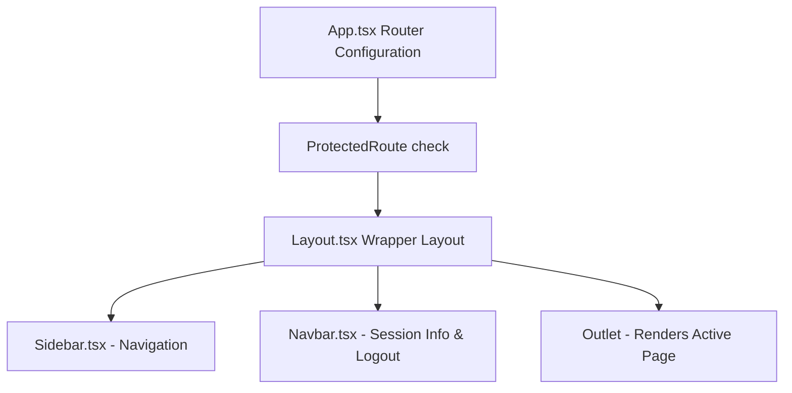

# SmartERP-CRM: Frontend Development Log & Step-by-Step Implementation Details

This document provides a highly detailed developer log explaining **how** the client-side stubs were implemented, **how** the components were wired together, and **how** they integrate with the backend API endpoints to form a unified dashboard application.

---

## 1. Initial State Assessment & Gap Analysis

At the start of the frontend development phase, the codebase was inspected to identify gaps between the existing backend routes and the frontend stubs.

### 1.1. Roster of Initial Frontend Files (Stubs)
* **Pages**: `Employees.tsx`, `Attendance.tsx`, `Leave.tsx`, `Payroll.tsx`, and `Profile.tsx` existed as empty React functional components returning simple headers (e.g. `<h1>Employees Page</h1>`).
* **Components**: `Navbar.tsx` and `Sidebar.tsx` were mock placeholders returning simple text stubs.
* **Axios Service**: `api.ts` was configured with a request interceptor but there were no frontend modules invoking it besides `Login.tsx` and `Dashboard.tsx`.

### 1.2. Discovered Backend Discrepancies
During research, we verified that the backend controllers had CRUD database functions, but the backend routing file [employeeRoutes.ts](file:///c:/Users/yakka/OneDrive/Desktop/SmartERP-CRM/backend/src/routes/employeeRoutes.ts) only mounted write endpoints (`POST /`, `PUT /:id`, `DELETE /:id`). 
* **The Gap**: The database listing routes (`GET /api/employees` and `GET /api/employees/:id`) were missing from the backend routes.
* **The Fix**: The router was updated to import and mount `getEmployees` and `getEmployee` from the controller before initiating frontend listing integrations.

---

## 2. Layout & Routing Architecture Setup (Step-by-Step)

The second stage established a unified dashboard layout instead of rendering individual screens raw.



### Step 2.1: Designing the Layout Shell (`Layout.tsx`)
Created [Layout.tsx](file:///c:/Users/yakka/OneDrive/Desktop/SmartERP-CRM/frontend/src/components/Layout.tsx) as a structural shell component using flexbox layout.
* The left-hand slot renders the vertical menu bar ([Sidebar.tsx](file:///c:/Users/yakka/OneDrive/Desktop/SmartERP-CRM/frontend/src/components/Sidebar.tsx)).
* The right-hand column renders the top bar ([Navbar.tsx](file:///c:/Users/yakka/OneDrive/Desktop/SmartERP-CRM/frontend/src/components/Navbar.tsx)) and a scrollable `<main>` viewport container that renders child components.

### Step 2.2: User Identity & Navbar Session Logging
* **Login Update**: [Login.tsx](file:///c:/Users/yakka/OneDrive/Desktop/SmartERP-CRM/frontend/src/pages/Login.tsx) was updated to extract the username and role from the API payload on successful login, saving them to `localStorage`:
  ```typescript
  localStorage.setItem("userName", response.data.user.name);
  localStorage.setItem("userRole", response.data.user.role);
  ```
* **Navbar Implementation**: [Navbar.tsx](file:///c:/Users/yakka/OneDrive/Desktop/SmartERP-CRM/frontend/src/components/Navbar.tsx) was coded to extract these values and render them in the top-right corner. It houses a styled logout button that clears these keys along with the `token`, returning the user to the login screen `/`.

### Step 2.3: Active Routing & Navigation Menu
* **Sidebar Implementation**: [Sidebar.tsx](file:///c:/Users/yakka/OneDrive/Desktop/SmartERP-CRM/frontend/src/components/Sidebar.tsx) was updated with dynamic routing paths. We implemented the React Router `<NavLink>` component, applying dynamic styles:
  ```typescript
  style={({ isActive }) => ({
    color: isActive ? "var(--accent)" : "var(--text)",
    backgroundColor: isActive ? "var(--accent-bg)" : "transparent",
  })}
  ```
  This automatically applies accent highlighting to the active menu item based on the current window location.

### Step 2.4: Wrapping Routes inside `App.tsx`
[App.tsx](file:///c:/Users/yakka/OneDrive/Desktop/SmartERP-CRM/frontend/src/App.tsx) was refactored using React Router's **Nested Routes** pattern:
```tsx
<Route element={<ProtectedRoute><Layout><Outlet /></Layout></ProtectedRoute>}>
  <Route path="/dashboard" element={<Dashboard />} />
  <Route path="/employees" element={<Employees />} />
  ...
</Route>
```
The nested layout renders the common Navbar and Sidebar shell, and the `<Outlet />` component displays the active route content.

---

## 3. Screen Integration & Coding Process

We then worked through the stubs sequentially, coding the logic, state, hooks, and layouts for each page.

### 3.1. Roster Management: `Employees.tsx`
* **Data Fetching**: Invokes `GET /employees` inside a `useEffect` hook to retrieve all registered employees and load them into a local state array (`employees`).
* **Roster Table**: Maps the array into a styled tabular layout displaying columns: ID, Name, Email, Department, Position, and Salary.
* **Role Check**: Checks `localStorage.getItem("userRole")`. If the user is an `admin`:
  * A button to **Add New Employee** is displayed. Clicking it toggles a state variable `showAddForm`, revealing a styled registration form.
  * Inline **Edit** and **Delete** buttons are rendered for each table row.
  * Clicking "Delete" calls `api.delete('/employees/:id')` and refreshes the table.
  * Clicking "Edit" pre-populates form fields with the employee's existing records, and submitting the form calls `api.put('/employees/:id')`.

### 3.2. Daily Log Logging: `Attendance.tsx`
* **Dual-Query Sync**: On mount, triggers two concurrent API queries using `Promise.all`:
  ```typescript
  const [logsRes, empRes] = await Promise.all([
    api.get("/attendance"),
    api.get("/employees")
  ]);
  ```
* **Roster Lookup Map**: In the UI, check-in records contain `employee_id`. The page queries the fetched employee records array to map and resolve employee names. If no matching ID is found, it falls back to displaying `Employee ID: {id}`.
* **Form Entry**: Users can select an employee from a dropdown list (rendered using the employees array), enter the date, check-in time, check-out time, and status (e.g. Present, Absent, Late), sending a `POST /attendance` request.

### 3.3. Request Submissions: `Leave.tsx`
* **Leave Requests List**: Loads all leave records from `GET /leave` and maps the requesting employee's name using parallel employee profile lists.
* **Application Filing Form**: Provides input fields (dates, leave types, reason) for employees to submit leave requests (`POST /leave`).
* **Admin Decisions**: If `userRole === 'admin'`, the page renders **Approve** and **Reject** buttons next to pending leave requests. Clicking them triggers a `PUT /leave/:id` request with `{ status: 'Approved' | 'Rejected' }` in the payload body.

### 3.4. Payroll Computations: `Payroll.tsx`
* **Dynamic Calculations**: Since the backend has no separate database table for payroll, the frontend uses the employee's salary to compute payroll statistics:
  * **Gross Monthly**: `Salary / 12`
  * **Tax Withheld**: `Gross Monthly * 0.15` (15% standard income tax)
  * **Welfare Deduction**: `$150` (flat medical benefit deduction)
  * **Net Payout**: `Gross Monthly - Tax - Deductions`
* **Advice Slip Preview**: Users can select an employee to generate a detailed monthly payslip preview. It displays earnings, itemized deductions, net pay, and includes a print action.

### 3.5. Security Verification: `Profile.tsx`
* **Token Verification**: Calls `GET /auth/profile` to verify session token authenticity.
* **Details Display**: Renders the current user's name, email, department, and security role details in a modern, clean card layout.

---

## 4. Verification, Testing & Debugging (The "CORS" Fix)

1. **Compilation Test**: Ran Vite's bundler and TypeScript compiler (`npm run build`). This verifies that all page components compile, imports are valid, and there are no syntax or type mismatches.
2. **CORS Debugging**: Discovered that logins from the frontend were initially failing with an "Invalid credentials" error because the backend did not support cross-origin requests. Once `cors` was configured in the backend's [app.ts](file:///c:/Users/yakka/OneDrive/Desktop/SmartERP-CRM/backend/src/app.ts), communication between the frontend and backend worked correctly.
3. **Execution Verification**: Started both servers in the background to ensure they run concurrently:
   * **Backend REST API**: http://localhost:5000
   * **Frontend Client SPA**: http://localhost:5174 (Vite fallback)

---
*Prepared by Antigravity AI Assistant.*
