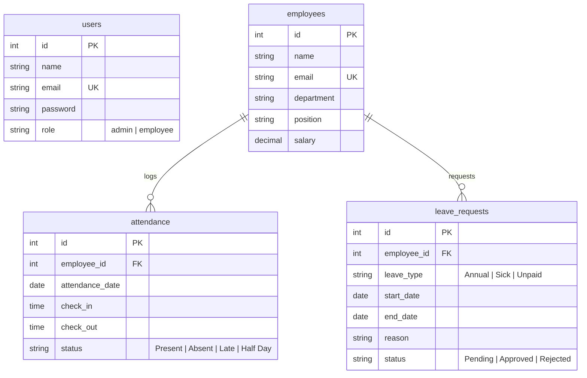
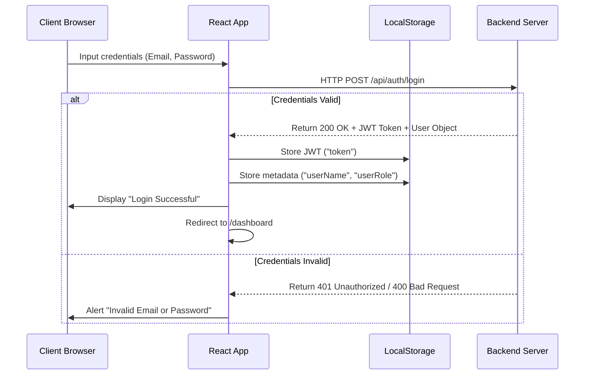
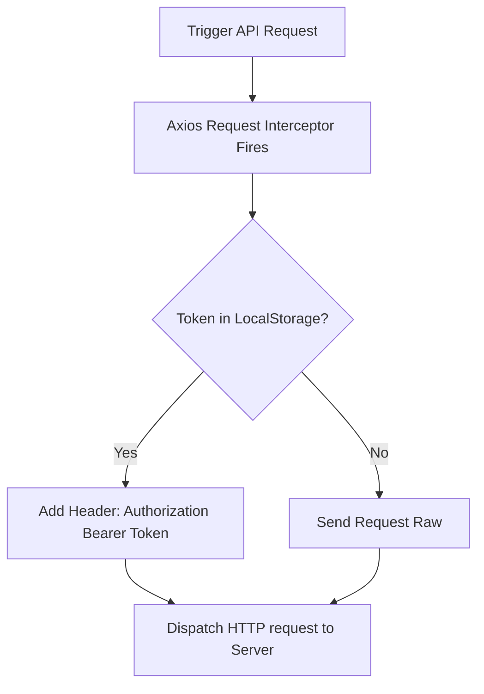

# SmartERP-CRM: Complete Project Walkthrough & Technical Blueprint

This document provides a comprehensive, professional explanation of the entire **SmartERP-CRM** system, detailing both the backend and frontend architectures, database schemas, security middleware, authentication mechanisms, page modules, and data flow sequences.

---

## 1. System Architecture Overview

SmartERP-CRM is structured as a classic **three-tier client-server application**:

```mermaid
graph TD
    A[React 19 Frontend SPA] -- HTTP Requests + JWT -- > B[Node/Express + TypeScript Backend]
    B -- Raw SQL Queries -- > C[PostgreSQL Database]
```

* **Presentation Tier**: A Single Page Application (SPA) built using React 19, TypeScript, and Vite. It handles client-side rendering, routing boundaries, browser state management, and interface display.
* **Application Tier**: A RESTful API built using Node.js, Express, and TypeScript. It processes client requests, coordinates business logic, enforces role authorization, and queries the database.
* **Data Tier**: A relational PostgreSQL database that stores user accounts, employee profiles, attendance logs, and leave requests.

---

## 2. Backend Architecture (Node.js, Express, & TypeScript)

The backend is built around a controller-route-model design pattern to keep the codebase modular and maintainable:

* **Entry Point (`src/server.ts` & `src/app.ts`)**: Configures Express, imports routers, applies global middleware (like JSON parser and CORS), and connects to the database pool.
* **Database Client (`src/config/db.ts`)**: Initializes connection pooling to PostgreSQL using the `pg` driver library.
* **Middleware Layer (`src/middleware/`)**: Contains authentication checks and user authorization layers.

### 2.1. Relational Database Schema
The database model structure is mapped across four tables, connected by foreign key relations:



### 2.2. Route Guarding and Security Middleware
API route protection is achieved using two custom middleware layers in sequence:

1. **Authentication Middleware (`authMiddleware.ts`)**:
   * Intercepts incoming requests.
   * Extracts the `Authorization: Bearer <token>` header.
   * Uses `jsonwebtoken` to verify the JWT signature.
   * Decodes the user payload (ID, Email, Role) and attaches it to the Express request object (`req.user`).
   * Returns `401 Unauthorized` if the token is missing or invalid.
2. **Role Authorization Middleware (`roleMiddleware.ts`)**:
   * Enforces role checks on sensitive routes.
   * Blocks non-admin users with a `403 Forbidden` error if they try to execute administrative actions (e.g. employee CRUD or leave decisions).

---

## 3. Frontend Architecture (React 19, TypeScript, & Vite)

The frontend organizes features by routing views and layout wrappers:

### 3.1. Routing, Guards, and Common Layout
* **Route Configuration (`App.tsx`)**: Utilizes React Router Dom to manage client-side routing.
* **ProtectedRoute Wrapper (`ProtectedRoute.tsx`)**: Validates session presence by checking for the JWT token in `localStorage` before permitting route render.
* **Layout Structure (`Layout.tsx`)**: Integrates the persistent left navigation sidebar ([Sidebar.tsx](file:///c:/Users/yakka/OneDrive/Desktop/SmartERP-CRM/frontend/src/components/Sidebar.tsx)) and top header navbar ([Navbar.tsx](file:///c:/Users/yakka/OneDrive/Desktop/SmartERP-CRM/frontend/src/components/Navbar.tsx)) into a unified user panel layout.

### 3.2. Page Views and Modules
* **Dashboard (`Dashboard.tsx`)**: Fetches summary metrics from `/api/dashboard` and displays them in structured grids.
* **Employees (`Employees.tsx`)**: Manages employee profiles. Restricts write operations (create, update, delete) to administrators by checking local storage metadata.
* **Attendance (`Attendance.tsx`)**: Retrieves check-in/out records and provides forms to log hours for employees.
* **Leave (`Leave.tsx`)**: Tracks leave applications. Employees can apply for time-off, and admins can toggle request statuses (Approve/Reject) directly.
* **Payroll (`Payroll.tsx`)**: Generates pay advice by retrieving annual salaries and calculating standard tax withholdings (15%), deductions, and net monthly payouts.
* **Profile (`Profile.tsx`)**: Connects to the profile verification API endpoint to display user details and active authorization tokens.

---

## 4. End-to-End Core Workflows

### 4.1. Authentication Flow


### 4.2. Request Interception Flow
The frontend centralizes API requests inside `src/services/api.ts` using Axios.



---

## 5. Architectural Design Rationale

* **TypeScript End-to-End**: Ensures type safety across both frontend models and backend endpoints, reducing runtime compilation errors.
* **Stateless REST API**: Storing auth state inside clients (using local storage JWTs) removes the need for server-side session stores, allowing the backend to scale easily.
* **React 19 SPA**: Leverages client-side hydration, concurrent rendering, and fast virtual DOM updates for high interface responsiveness.
* **PostgreSQL Pooling**: Connects client calls to raw SQL structures via connection pools, preventing connection starvation under high usage.
* **CSS Custom Variables**: Supports light/dark mode styling natively, adjusting colors dynamically based on system preferences with minimal CSS footprint.

---
*Technical master document prepared for SmartERP-CRM development team.*
