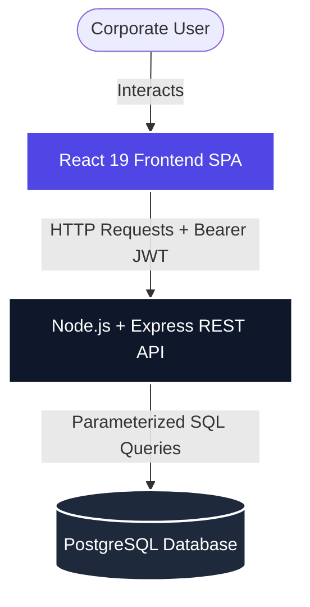
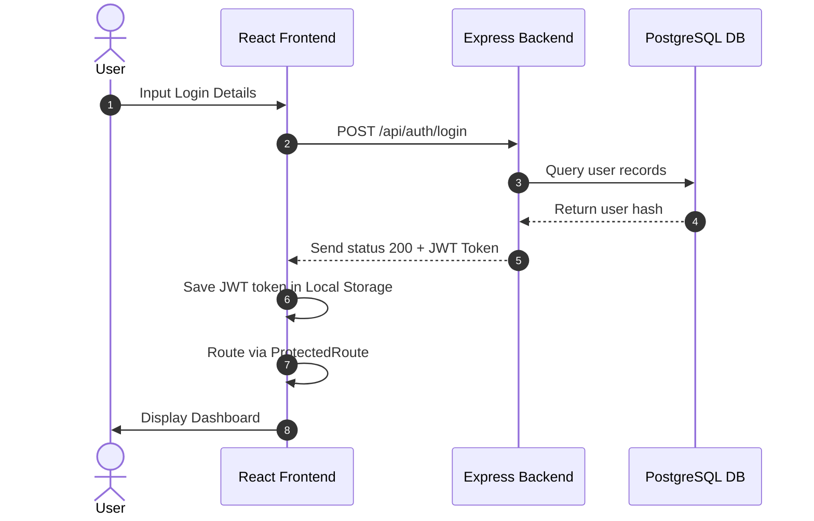

# 💼 SmartERP-CRM Operations Portal

> A premium, modern, and interactive Enterprise Resource Planning & Customer Relationship Management dashboard built for streamlined corporate operations.

[](https://react.dev)
[](https://nodejs.org)
[](https://www.postgresql.org)
[](https://www.typescriptlang.org)
[](https://opensource.org/licenses/MIT)

---

## 📖 Table of Contents
1. [Project Overview](#-project-overview)
2. [Features](#-features)
3. [Tech Stack](#-tech-stack)
4. [System Architecture](#-system-architecture)
5. [Project Structure](#-project-structure)
6. [Installation Guide](#-installation-guide)
7. [Environment Variables](#-environment-variables)
8. [Screenshots](#-screenshots)
9. [API Overview](#-api-overview)
10. [Authentication Flow](#-authentication-flow)
11. [Frontend Workflow](#-frontend-workflow)
12. [Database Design](#-database-design)
13. [Key Learnings](#-key-learnings)
14. [Future Enhancements](#-future-enhancements)
15. [Contributing](#-contributing)
16. [License](#-license)
17. [Author](#-author)

---

## 🌟 Project Overview

**SmartERP-CRM** is an enterprise-grade administrative operations suite designed to handle employee directories, punch check-ins, time-off requests, and monthly salary calculations. 

### Why it was built
In modern corporate environments, tracking staff directories, attendance sheets, and payroll details across scattered systems leads to data loss and admin bottlenecks. SmartERP-CRM consolidates these functions into a single, cohesive portal.

### Target Users
* **HR Managers & Admins**: To manage the directory roster, approve leaves, track check-ins, and print payslips.
* **Corporate Employees**: To log daily shifts, apply for leaves, and inspect monthly pay advice breakdown.

---

## ⚡ Features

* **JWT Stateless Authentication**: Secure sessions via JSON Web Tokens stored locally in client-side persistence headers.
* **Role-Based Access Control (RBAC)**: Custom routing and action filters restricting edit/delete functions to `admin` profiles.
* **Real-time Dashboard**: Dynamic statistics overview counting active staff, presence rates, and pending leaves.
* **Roster Management**: CRUD operations to register, edit, and delete employee profiles.
* **Attendance Logs**: Daily check-in/out timestamps mapping shift presence states (*Present*, *Absent*, *Late*, *Half Day*).
* **Leave Workflows**: Balance counters (Sick, Annual, Unpaid) and status timelines for approvals.
* **Payroll Processing**: Automatic computation of 15% income tax withholding, benefits, and net salary.
* **Responsive Layouts**: Collapsible sidebars and fluid layouts scaling to desktops, tablets, and mobile devices.

---

## 🛠️ Tech Stack

| Layer | Technology | Key Features / Purpose |
| :--- | :--- | :--- |
| **Frontend** | React 19, TypeScript | SPA architecture, Virtual DOM rendering |
| **Styling** | Custom CSS | Variables-based color scheme tokens, glassmorphic card overlays |
| **Routing** | React Router DOM v7 | Nested route configurations & Protected Route guards |
| **API Client** | Axios | Request interceptors attaching bearer auth headers |
| **Backend** | Node.js, Express.js | Stateless REST API, request routers, and controllers |
| **Database** | PostgreSQL | Relational schema tables with cascading delete constraints |
| **Security** | Bcrypt, JSON Web Tokens | Hashed passwords, signed token-based session validity |
| **Build Tool** | Vite | ES Modules build engine and Hot Module Replacement (HMR) |

---

## 📐 System Architecture

Below is the high-level architecture diagram representing data flow between the tiers:



---

## 📂 Project Structure

```text
SmartERP-CRM/
├── backend/                  # Node.js + Express backend server
│   ├── src/
│   │   ├── config/           # Database pool configurations
│   │   ├── controllers/      # Route controllers (Auth, Dashboard, Employee, Leave)
│   │   ├── middleware/       # JWT validators & RBAC validation filters
│   │   ├── models/           # DB lookup schemas
│   │   ├── routes/           # Endpoint router mappings
│   │   └── server.ts         # Server entry file
│   ├── .env                  # Backend credentials setup
│   ├── tsconfig.json         # TypeScript compiler setups
│   └── package.json          # Server manifest file
├── frontend/                 # React frontend application
│   ├── src/
│   │   ├── components/       # Layout wrapper, Navbar, Collapsible Sidebar, ProtectedRoute
│   │   ├── pages/            # Login, Dashboard, Employees, Attendance, Leave, Payroll, Profile
│   │   ├── services/         # Axios API interceptor configurations
│   │   ├── App.css           # Grids, timelines, and layout style tokens
│   │   ├── App.tsx           # Router endpoints wrapper
│   │   ├── index.css         # Global typography, color variables, and modals styling
│   │   └── main.tsx          # DOM root mount
│   ├── tsconfig.json         # Client TypeScript compiler setups
│   └── package.json          # Client dependencies manifest
├── README.md                 # Project root documentation
└── .gitignore                # Global ignore configurations
```

---

## ⚙️ Installation Guide

### Prerequisites
* **Node.js** (v18.0.0 or higher)
* **PostgreSQL** (v14.0 or higher)

### 1. Clone the repository
```bash
git clone https://github.com/aishwaryayakkanti/SmaertERP-CRM.git
cd SmaertERP-CRM
```

### 2. Configure Backend Server
1. Navigate to the backend folder:
   ```bash
   cd backend
   ```
2. Install dependencies:
   ```bash
   npm install
   ```
3. Setup environment variables by creating a `.env` file in the `backend/` directory:
   ```env
   PORT=5000
   DB_HOST=localhost
   DB_PORT=5432
   DB_USER=postgres
   DB_PASSWORD=your_postgres_password
   DB_NAME=smart_erp
   JWT_SECRET=your_jwt_signature_key
   ```
4. Initialize the PostgreSQL database schema by running the query scripts inside your pgAdmin or psql tool (see [Database Design](#-database-design) below).
5. Spin up the dev server:
   ```bash
   npm run dev
   ```

### 3. Configure Frontend Client
1. Open a new terminal and navigate to the frontend folder:
   ```bash
   cd frontend
   ```
2. Install package dependencies:
   ```bash
   npm install
   ```
3. Start the Vite dev server:
   ```bash
   npm run dev
   ```
   *Vite will start the client portal at `http://localhost:5173/`.*

---

## 🔐 Environment Variables

### Backend (`backend/.env`)
```env
PORT=5000
DB_HOST=localhost
DB_PORT=5432
DB_USER=postgres
DB_PASSWORD=your_password
DB_NAME=smart_erp
JWT_SECRET=supersecretjwtkey
```

### Frontend
By default, the client communicates with the backend via `http://localhost:5000/api` configured in [api.ts](file:///c:/Users/yakka/OneDrive/Desktop/SmartERP-CRM/frontend/src/services/api.ts).

---

## 🖼️ Screenshots

> [!NOTE]
> *Placeholders for screenshots showing key application views.*

| Page | View Description |
| :--- | :--- |
| **Login** | *[Insert Login Screen Screenshot]* |
| **Dashboard** | *[Insert Dashboard Analytics Screenshot]* |
| **Employee Module** | *[Insert Roster Table List Screenshot]* |
| **Attendance Tracker** | *[Insert Check-in Calendar Logs Screenshot]* |
| **Leave Board** | *[Insert Time-off Applications Modal Screenshot]* |
| **Payroll Center** | *[Insert Payslip Invoice Advice Screenshot]* |

---

## 📡 API Overview

### 🔑 Authentication Endpoints
* **`POST /api/auth/register`**: Registers a new user account profile.
* **`POST /api/auth/login`**: Authenticates user details and returns a signed JWT token.
* **`GET /api/auth/profile`**: Validates bearer authorization headers and returns active profile details.

### 📊 Dashboard Endpoints
* **`GET /api/dashboard`**: Aggregates metadata counts from all schemas to display on stats cards.

### 👥 Employee Roster Endpoints
* **`GET /api/employees`**: Lists all employee profiles.
* **`POST /api/employees`**: Registers a new employee profile *(Admin Only)*.
* **`PUT /api/employees/:id`**: Modifies employee details *(Admin Only)*.
* **`DELETE /api/employees/:id`**: Terminates and removes employee records *(Admin Only)*.

### 📅 Attendance Endpoints
* **`GET /api/attendance`**: Lists daily shift logs.
* **`POST /api/attendance`**: Logs a check-in / check-out time.

### 📝 Leave Request Endpoints
* **`GET /api/leave`**: Lists leave requests.
* **`POST /api/leave`**: Submits a new time-off application.
* **`PUT /api/leave/:id`**: Updates request status to Approved / Rejected *(Admin Only)*.

---

## 🔄 Authentication Flow

Below is the sequential diagram detailing how JWT token-based sessions are verified:



---

## ⚙️ Frontend Workflow

1. **Routing Strategy**: Built using `react-router-dom`. Protected views are wrapped inside a `<ProtectedRoute>` component which checks local storage credentials before mounting layout shells.
2. **REST Connectivity**: Handled via custom Axios client instances. A request interceptor automatically mounts `Bearer <token>` headers before requests leave the client.
3. **State Syncing**: State management is handled through React's `useState` hooks. Pages perform data fetches inside `useEffect` blocks triggered on mount, keeping interface components reactive.

---

## 🗄️ Database Design

The relational database in PostgreSQL contains four primary operational tables:

```sql
-- Users Table
CREATE TABLE users (
    id SERIAL PRIMARY KEY,
    name VARCHAR(100) NOT NULL,
    email VARCHAR(150) UNIQUE NOT NULL,
    password VARCHAR(255) NOT NULL,
    role VARCHAR(50) DEFAULT 'employee' CHECK (role IN ('admin', 'employee'))
);

-- Employees Table
CREATE TABLE employees (
    id SERIAL PRIMARY KEY,
    name VARCHAR(100) NOT NULL,
    email VARCHAR(150) UNIQUE NOT NULL,
    department VARCHAR(100) NOT NULL,
    position VARCHAR(100) NOT NULL,
    salary DECIMAL(12, 2) NOT NULL
);

-- Attendance Table
CREATE TABLE attendance (
    id SERIAL PRIMARY KEY,
    employee_id INT NOT NULL REFERENCES employees(id) ON DELETE CASCADE,
    attendance_date DATE NOT NULL,
    check_in TIME NOT NULL,
    check_out TIME,
    status VARCHAR(50) DEFAULT 'Present' CHECK (status IN ('Present', 'Absent', 'Late', 'Half Day')),
    UNIQUE (employee_id, attendance_date)
);

-- Leave Requests Table
CREATE TABLE leave_requests (
    id SERIAL PRIMARY KEY,
    employee_id INT NOT NULL REFERENCES employees(id) ON DELETE CASCADE,
    leave_type VARCHAR(100) NOT NULL CHECK (leave_type IN ('Annual', 'Sick', 'Maternity/Paternity', 'Unpaid')),
    start_date DATE NOT NULL,
    end_date DATE NOT NULL,
    reason TEXT NOT NULL,
    status VARCHAR(50) DEFAULT 'Pending' CHECK (status IN ('Pending', 'Approved', 'Rejected'))
);
```

---

## 💡 Key Learnings

* **Stateless API Guarding**: Gained experience implementing JWT authorization pipelines using Express middleware.
* **Component Lifecycle Optimization**: Leveraged Vite's HMR and React hooks to manage side-effects, minimizing redundant SQL queries.
* **Relational Schema Integrity**: Enforced database consistency using constraints and cascading deletes in PostgreSQL.
* **Clean Code Structure**: Managed layout dividers, nested routing architectures, and styled components in TypeScript.

---

## 🚀 Future Enhancements

* **Email Notification System**: Implement automatic email alerts for leave approvals and monthly pay advice dispatches.
* **Advanced Reports Generation**: Add PDF exporters to generate payroll summaries and print logs.
* **Vibrant Analytics Libraries**: Migrate inline SVG charts to dedicated libraries like Recharts or Chart.js for interactive tooltips.
* **File Upload Integration**: Support profile avatar image uploads to AWS S3 or Cloudinary.

---

## 🤝 Contributing

Contributions are welcome! Please follow these steps:
1. Fork the project repository.
2. Create a feature branch: `git checkout -b feature/AmazingFeature`.
3. Commit your changes: `git commit -m 'Add some AmazingFeature'`.
4. Push to the branch: `git push origin feature/AmazingFeature`.
5. Open a Pull Request.

---

## 📄 License

This project is licensed under the MIT License - see the [LICENSE](LICENSE) details.

---

## ✍️ Author

* **Aishwarya Yakkanti**
* **GitHub**: [@aishwaryayakkanti](https://github.com/aishwaryayakkanti)
* **LinkedIn**: [aishwaryayakkanti](https://linkedin.com/in/aishwaryayakkanti)
* **Email**: contact@company.com
